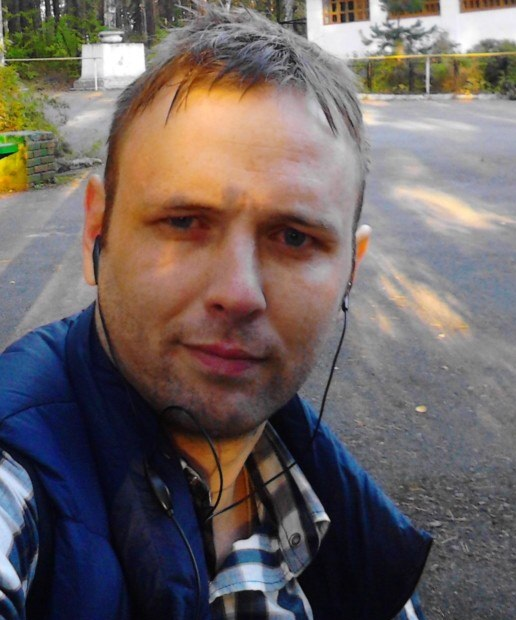

Deprecated
[Ru](ru.md)
<h1 align="center">PHP developer CV</h1> 
<table width="100%" ><tr><td>

 
	<b align="center">Junior to Middle</b>
	    
	Alexey Pakhomov  
	born in 1984  	  
	 
	from Russia, Yekaterinburg city   	
	 	
	 Telegram : <a href="https://t.me/alexeyp0708">@alexeyp0708</a>  
	 Skype : <a href="https://join.skype.com/invite/c62EbQTkg5Fc">live:alexeyp0708</a>  
	 Email : <a href="mailto:vacancy@sun66.ru">vacancy@sun66.ru</a>  
	  
	<a href="https://github.com/ALexeyP0708/developer_cv/discussions/1">Github discussion developer cv</a>   
	 
	 
	 
	 
	 
	  
	 
	 
	 
	 
	   
	 

</td></tr></table>
 

Hey.
I'm search for  a creative team for long-term cooperation, who will share their quality experience.  
You will need to use SOLID concepts, design patterns, CD / CI unit tests, and well-organized workflows in your projects.
And I guarantee you that a good and strong specialist will appear on your team.

## About me.

I am an amateur PHP developer with a good knowledge base.   My knowledge is **middle** qualifications.
Since there is no production experience, the objective assessment of my knowledge is  **experienced Junior**

**What can you find out about me:**
1. My deep experience in PHP / JS starts in 2017;
2. I'm self-taught. I did not study at the institute as a programmer, did not attend specialized courses.  My knowledge base is formed from technical documentation and experiments.
3.  Knowledge in PHP:
	- PHP syntax - good knowledge;
	-  PSR specification - middle knowledge.  
	- ООП и SOLID - good knowledge.  At the stage of implementing an idea, I often write "bold" classes and "bold" methods.  In the future, I try to decompose code and share responsibility (S);
	-  design patterns - minimum knowledge. I am familiar with design patterns, but I have not designed code based on patterns.  In my case, the design of the code was formed at the stage of writing the code.
	- Unit tests- middle knowledge. Lately I've been began to write BDD tests.  TDD tests did not write;
	- MVC/HMVC  -good knowledge;
	- composer- middle knowledge; 
	- Laravel -  minimum (basic) knowledge. 
4. Knowledge in JS:
	- ECMA Script  2015 and after - good knowledge;
	- NodeJS - minimum knowledge;
	- DOM (browsers) - middle knowledge;
5. DataBase:
	- MySql и SQLite -  middle knowledge.  
	-  MongoDB - middle knowledge. Experience 4-5 months of active use. 
6.  OpenAPI 3 и JSONSchema -   minimum knowledge. 
8.  Code Documentation -  middle knowledge. ... I try to document all my code in PHPDoc and JSDoc. Also fill in README.md.
9.  GIT - middle knowledge;
10. Linux - User level;
11. Server administration:
	- Apache 2.4 + PHP +MySQL + OpenSSL- setting up servers for the developer's environment;
	- Ngnix - no experience;  
12. Docker - no experience;
13. CD/CI - no experience;
14. Current IDE - PhpStrom ;
15. English is minimal;

Knowledge qualification and evolution of code quality can be assessed by looking at my repositories [GitHub](https://github.com/ALexeyP0708).    
I ask you not to focus on the quality of the code, which you are used to writing.   
From the first time, high-quality code is written only with well-formed code patterns.  
In practice, in the first place is the implementation of the idea and its concept, then comes the implementation of quality (refactoring stage). And quality takes time and resources.

## More about me.

**Learning:**  

In 2004 I graduated from the Miass Electromechanical College with a degree in Communication with Mobile Objects.  

In 2008 I graduated in absentia from the Ural Technical Institute of Communications and Informatics  with a degree in “Multichannel Information Systems”.  

### Work experience  

#### In service of construction and communication  

2005.04 - 2006.12 - assembler of radio-electronic equipment and instruments - 2nd category (Noyabrskneftespetsstroy LLC. (Literally -   Special Oil Builder Noyabrsk city LLC)   fired of my own will);  
Experience - construction and maintenance in the field of wire communication;  

2007.12 - 2009.03 - Communication engineer of the 1-2 category  (SeverGazStroy LLC (Literally - North Gas Builder LLC) - fired of my own will);   
Experience - construction and maintenance in service of wire communication, construction and modernization of GSM base stations;  

2009.06 - 2009.10 - Specialist of the 1st category of the information technology department in the management apparatus. ( Uralneft OJSC (Literally - Ural Oil OJSC) - dismissed on staff redundancy due to bankruptcy).  
Experience - design / implementation / administration of office PBX, IP telephony, organization of communication on drilling rigs.  

2009.12 - 2011.03 -   Communication engineer of the 1st category ( Construction company TRON LLC) - fired of my own will)  
Experience - installation of base station equipment and 3G communication antennas. Installation of radio relay equipment and antennas.  

2011.04 - 2011.06 - private activity (traveling brigade) for the installation of the installation of 3G cellular communication equipment of the MEGAFON OJSC network.   

on 2012 - Tired of working as a simple worker with the position of an engineer.    
  
#### In service of programming 

2019.02 - 1 month - PHP programmer (Individual entrepreneur  Malygin I.Yu. - dismissed of his own free will - In fact, the Entrepreneur was not doing well )   

2019.09 - 2020.02 - Software engineer (Marketing Technologies LLC - dismissed on its own - in fact, incompetence / unprofessionalism / disorganization of the team lead).       

 

	<a href="https://github.com/ALexeyP0708">© AlexeyP0708</a>

