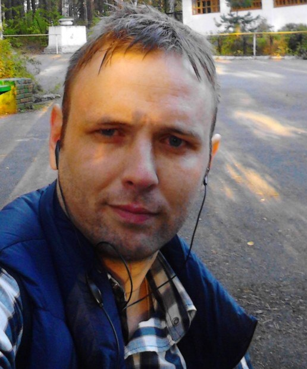

[En](README.md)  
<h1 align="center">PHP developer CV</h1> 
<table width="100%" ><tr><td>

 
	<b align="center">Junior +</b>
	    
	Alexey Pakhomov  
	born in 1984  	  
	 
	from Russia, Yekaterinburg city   	
	 	
	 Telegram : <a href="https://t.me/alexeyp0708">@alexeyp0708</a>  
	 Email : <a href="mailto:alexeyp0708@gmail.com">alexeyp0708@gmail.com</a> 
	<a href="https://github.com/ALexeyP0708">Github </a>  
	<a href="https://stackoverflow.com/users/11903519/alexeyp0708">Stackoverflow</a>  
    
	 
	 
	 
	 
	  
	 
	 
	 
	 
	   
	 

</td></tr></table>
 

## Обо мне.
Ищу не спеша работу PHP/JS программистом  на ставку Junior+.  Главные условия к команде - вы должны быть профессионалами. 

Самодостаточный со своими амбициями. 

### Мои знания:  
0. отсутствует коммерческий опыт;
1. Знание PHP/JS начинаются с 2017 года;
2. Я самоучка.  База моих знаний сформирована из технической документации и экспериментов;  
4.  Знание в  PHP:
	- синтаксис PHP;
	- спецификации PSR;
	- ООП и SOLID;
	- Паттерны  проектирования;
	- Unit tests - в своих проектах всегда пишу. 
	- MVC/HMVC  -академические знания; 
	- Сomposer- хорошо;
	- Laravel - на уровне документации; 	
5. Знание JS:
	- ECMA Script от 2015 и выше -хорошо;
	- NodeJS - минимум;
	- DOM (браузеры) - удовлетворительно;
6. БД:
	- SQL - удовлетворительно.  На базе документации.
	-  MongoDB - удовлетворительно. На базе документации.
7.  Документирование кода -  в своих проектах всегда пишу;
8.  GIT - хорошо;
9. Linux -уровень пользователя;
10. Администрирование:
	- Apache 2.4 + PHP + MySQL + OpenSSL - настройка серверов для среды разработчика;
	- Ngnix - опыт отсутствует;  
11. Docker- опыт отсутствует;
12. CD/CI-опыт отсутствует;
13. Текущее IDE : PhpStrom,  VSCode
14. Английский язык - минимальный. С 2006 года успешно применяю программные переводчики в переводе любой тех документации и мне этого достаточно.  

Уровень знаний и эволюцию качества кода можно оценить, посмотрев на мои репозитории. [GitHub]
(код не самый идеальный, ибо много что исправленного хранится в закрытых репозиториях)
(https://github.com/ALexeyP0708).    

2017 -2019 года изучал "под капотом"  CMS Jomla, CMS MODX, CMS instantcms2, Sygar CRM.  На сегодняшний день знания потеряны.
YII2 - совсем немного изучал и писал под него тестовые задания. 
Laravel - изучал "под капотом", немного писал кода для тестовых заданий
Symfony - читал доку. 

## Дополнительно обо мне.

### Учеба   

В 2004 году закончил "Миасский электромеханический техникум" по специальности "Средства связи с подвижными объектами".  

В 2008 году закончил заочно "Уральский технический институт связи и информатики"  по специальности "Многоканальные информационные системы".  

### Трудовой стаж в сфере строительства и связи  

#### В сфере строительства и связи

04.2005г. - 29.12.2006 г. - монтажник радиоэлектронной аппаратуры и приборов - 2 разряд (ООО Ноябрьскнефтеспецстрой - уволен по собственному желанию);  
Опыт - строительство и обслуживание в сфере проводной связи;  

01.2007г. - 03.2009г. - Инженер связи 1-2 категории. ( ООО СеверГазСтрой - уволен по собственному желанию);   
Опыт - строительство и обслуживание в сфере проводной связи, строительство и модернизация Базовых cтанций  сотовой связи GSM;  

06.2009г. - 10.2009г. - Специалист 1 категории отдела информационных технологий в аппарат управления. (ОАО Уралнефть - уволен по статье сокращение, в связи с последующем  банкротством компании ).  
Опыт - проектирование/внедрение/администрирование  офисной АТС, IP телефонии, организация связи на буровых вышках.  

12.2009 г. - 03.2011 г. -  Инженер связи 1 категории (ООО Строительная компания ТРОН - уволен по собственному желанию)  
Опыт -  установка оборудования базовых станций  и антенн 3G связи. Установка РРЛ оборудования и антенн.  

С 04.2011 - 06.2011 г. - частная деятельность (разъездная бригада) по установке оборудования 3G  сотовой связи.
 с 2012 года - "самозанятый" в строительстве,  (электрика, связь), посуточная сдача жилья, пассивные доходы.  

#### В сфере программирования
 02.2019 года - 1 месяц - программист (ИП Малыгин И.Ю. - Официально уволен по собственному желанию . По факту  у ИП проигран тендер , и директор попросил уволиться. )

с 09.2019 (оф. с 11.2020) - 02 2020 г. - Инженер программист (ООО "Технологии маркетинга" - Официально уволен по собственному желанию. По факту не сошлись взглядами с руководителем отдела в организации моего рабочего процесса). 

c 2020  продолжаю писать код в рамках Хоби,  и занимаюсь кап. ремонтом в собственной квартире.

 

	<a href="https://github.com/ALexeyP0708">© AlexeyP0708</a>

